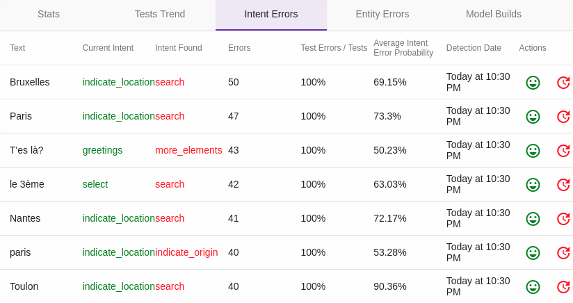

# Evaluate the relevance of a NLP model

## Tabs

Five tabs are used to control the relevance of the model:

1. **Stats** : Monitores model perfomance in production:
    * self-evaluation of the model about its relevance in terms of recognition of intent and entities
    * number of calls and errors
    * average execution time
2. **Model Builds** : the cimplete list of model builds    
3. **Test Trend** : evolution of the relevance of [model tests](#partial-model-tests) 
4. **Intent Errors** : the list of intent errors found with model tests
5. **Entity Errors** : the list of entity errors found with model tests

## Model Tests

Model tests are used to detect qualifications errors.

Temporarily models are built from a random part of the whole sentence set of the model (90% for example)
and then tested against the remaining sentences. 

The process is repeated a number of times and the most frequent errors are pushed to an admin user.

Model tests are useful only with large models.

### Intent errors

Click on the *Intent Errors* tab:

Since the picture above is built from a very simple model, no real error has been detected.
 We can nevertheless note that in some cases the model is systematically wrong with a high probability.  

### Entity errors

These errors can be viewed via the *Entity Errors* tab.

