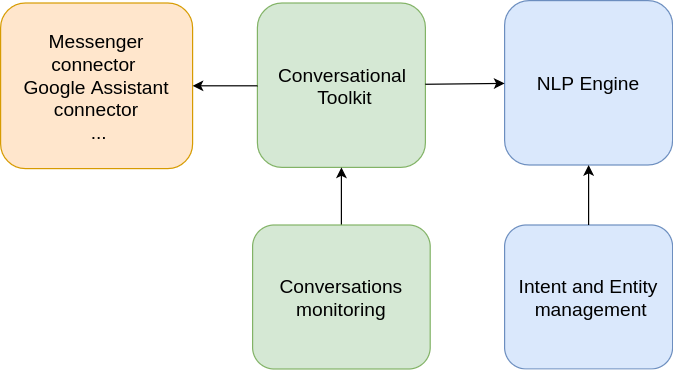
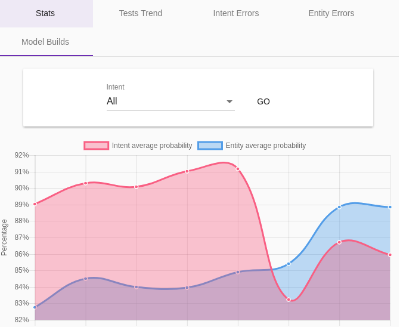

# Tock, The Open Conversation Kit

## Introduction

**Tock** is a toolkit for building conversational agents (or bots).

Unlike other toolkits, it does not depend on third-party APIs (but can easily integrate with them if necessary),
 and is fully Open Source, so you get complete control over your data and algorithms.

The source code is on github: [https://github.com/voyages-sncf-technologies/tock](https://github.com/voyages-sncf-technologies/tock) under the [Apache 2 license](https://github.com/voyages-sncf-technologies/tock/blob/master/LICENSE).

Two major components are available:

* The NLP (Natural Language Processing) stack
* A conversational framework that uses NLP services and provides connectors (for Messenger, Google Assistant and Slack at this time).

 
The NLP stack is independent of the conversational framework.
It is therefore possible to use the NLP without having to masterize the complexity induced by the management of conversations and contexts.

## A Platform to Build NLP Models

### Administration Interface

With the administration interface, you can qualify
sentences in order to build [NLP](https://en.wikipedia.org/wiki/Natural_language_processing) models:

### Quality Monitoring

This interface also provides stats about realtime usage:

### [Stanford CoreNLP](https://stanfordnlp.github.io/CoreNLP/) or [Apache OpenNLP](https://opennlp.apache.org/)

The underlying NLP engine is based on one of these open-source solutions (you can select the engine via the admin interface).
Tock provides a level of indirection that allows integration with other NLP libraries.
The integration of [SparkNLP](http://nlp.johnsnowlabs.com) is also planned.

### [Duckling](https://github.com/facebook/duckling)

A date and simple types parsing tool based on the open-source [Duckling library](https://github.com/facebook/duckling)
is also integrated by default, in order to find and evaluate entities.

### NLP API

The models can be tested via the provided [API](../api/).

## A Conversational Framework

The Tock Conversational Framework provides all you need to create and manage dialogs. 

[Kotlin](https://kotlinlang.org/) is used as core language of the stack.

The framework uses the Tock NLP stack via its [API](../api/).

### Context and History Management

Dialog contexts and conversation history management are supported.
Advanced features like entity values merge are also provided.

### Third party connectors

Connectors to Facebook Messenger, Google Assistant, WhatsApp, RocketChat, Twitter, Alexa, Teams and Slack are available.
It is easy to create others, whether to connect to other channels (please contribute!) or for custom needs.

### Conversations monitoring
You can also test the bots and follow the conversations of users directly in the admin interface.

## Genesis of the project
                    
The project was initiated in 2016 by the Innovation Team of [oui.sncf](https://www.oui.sncf/)
as a first step to build voice commands feature in its [mobile applications](https://www.oui.sncf/mobile).

The toolkit was then used to implement its [Messenger Bot](https://www.messenger.com/t/oui.sncf) (fr only).

Since, a dedicated team at oui.sncf maintains the stack.

The [oui.sncf Google Assistant](https://assistant.google.com/services/a/id/164effe7c138100b/) is also based on Tock,
as well as the web-based [OUIbot](https://www.oui.sncf/bot/) (fr only for now).

The tools were open-sourced in the hope they will be useful. Contributions are welcomed.

## Technologies

The application platform is the [JVM](https://en.wikipedia.org/wiki/Java_virtual_machine).
 
The core language is [Kotlin](https://kotlinlang.org/).

[Vert.x](http://vertx.io/) and [MongoDB](https://www.mongodb.com) are also used internally. 

The administration interfaces are implemented in [Angular4](https://angular.io/) / [Typescript](https://www.typescriptlang.org/).

## Open-sourced projects

* The main project is under [Apache 2 license](https://github.com/voyages-sncf-technologies/tock/blob/master/LICENSE). The source code is available on GitHub: [https://github.com/voyages-sncf-technologies/tock](https://github.com/voyages-sncf-technologies/tock)

* However an optional dependency, [Stanford CoreNLP](https://stanfordnlp.github.io/CoreNLP/), is under [GPL license](http://www.gnu.org/licenses/gpl-3.0.html).
 The code using this dependency is therefore located in a separate project, under GPL license: [https://github.com/voyages-sncf-technologies/tock-corenlp](https://github.com/voyages-sncf-technologies/tock-corenlp)

Finally two other projects are available:
 
* A project containing docker images: [https://github.com/voyages-sncf-technologies/tock-docker](https://github.com/voyages-sncf-technologies/tock-docker)
* A project containing an example of a bot implementation based on the Open Data [SNCF APIs](https://www.digital.sncf.com/startup/api): [https://github.com/voyages-sncf-technologies/tock-bot-open-data](https://github.com/voyages-sncf-technologies/tock-bot-open-data)
