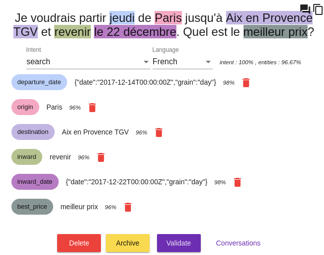

# Bienvenue dans la documentation de Tock!

## Présentation

**Tock** (*The Open Conversation Kit*) est une boite à outils permettant de construire des agents conversationnels (ou bots). 

Contrairement à la plupart des autres solutions, il ne dépend pas d’API tierces (mais peut en intégrer aisément si nécessaire) : il est donc possible de conserver le contrôle complet de ses données et de ses algorithmes.

Le code source de l'ensemble se trouve sur github : [https://github.com/voyages-sncf-technologies/tock](https://github.com/voyages-sncf-technologies/tock) sous la [licence Apache 2](https://github.com/voyages-sncf-technologies/tock/blob/master/LICENSE). 

Deux composants majeurs sont disponibles, le moteur NLP ( pour Natural Language Processing ou [TALN](https://fr.wikipedia.org/wiki/Traitement_automatique_du_langage_naturel) en français),
 et un framework conversationnel qui intègre les services NLP et différents connecteurs comme Messenger, Google Assistant ou Slack. 
 
La composante NLP est indépendante de la partie conversationnelle. 
Il est donc possible d'utiliser le NLP sans devoir maîtriser la complexité induite par la gestion des conversations.
Dans certain cas d'usage importants, comme l'[Internet des objets](https://fr.wikipedia.org/wiki/Internet_des_objets), 
l'utilisation d'un modèle NLP seule est pertinente.

## Une plateforme pour construire des modèles d'analyse du language naturel 

### Interface d'administration

L'outil principal est constitué par une interface d'administration qui permet de qualifier des 
phrases afin de construire des modèles de traitement automatique du langage naturel ( [TALN](https://fr.wikipedia.org/wiki/Traitement_automatique_du_langage_naturel) ) :

### Suivi de qualité des modèles

Cette interface fournit également les outils pour faire évoluer les modèles et permet de monitorer leurs pertinences :

### [Stanford CoreNLP](https://stanfordnlp.github.io/CoreNLP/) ou [Apache OpenNLP](https://opennlp.apache.org/)

La construction automatique des modèles est basée sur une de ces solutions open-sources (au choix). 
Tock fournit un niveau d'indirection qui permet d'intégrer d'autres librairies NLP. 
L'intégration de [SparkNLP](http://nlp.johnsnowlabs.com) est d'ailleurs en cours d'étude.

### [Duckling](https://github.com/facebook/duckling) 

Un outil de parsing de dates et de types simples basé sur la librairie open-source [Duckling](https://github.com/facebook/duckling) 
est également intégré par défaut.

### API NLP

Les modèles peuvent être utilisés via l'[API](../api/) mis à disposition.

## Un framework conversationnel 

Ce framework est la deuxième brique qui permet de construire des assistants.

Elle utilise la brique de TALN de Tock via son [API](../api/).

### Gestion du contexte et de l'historique 
La gestion des contextes des dialogues et de l’historique des conversations est automatiquement disponible. 
Des notions avancées comme la fusion d'entités sont également mis à disposition.
(par exemple le fait de préciser la date "demain" puis plus tard "plutôt le soir" met automatiquement la valeur de la date à jour)

### Connecteurs tiers
Des connecteurs à Facebook Messenger, Google Assistant et Slack sont disponibles. 
Il est possible d'en créer facilement d'autres, que ce soit pour se connecter à d'autres canaux ou pour répondre à des besoins spécifiques.

### Suivi des conversations
Enfin une interface d'administration est mise à disposition et permet de tester les bots et de suivre les conversations des utilisateurs. 

## Genèse du projet
                    
Le projet a été initié en 2016 par l'équipe Innovation de [Oui.sncf](https://www.oui.sncf/) 
dans un premier temps afin de motoriser l'analyse des commandes vocales sur ses [applications mobiles](https://www.oui.sncf/mobile).

L'outil a ensuite été utilisé pour implémenter son [Bot Messenger](https://www.messenger.com/t/oui.sncf).

Depuis, une [équipe dédiée](https://open.voyages-sncf.com/ouiwork/innovation/assistant-google-et-google-home-atelier-de-decouverte-test-et-discussions) au sein de OUI.sncf fait évoluer et maintient la solution.

L'[assistant Google OUI.sncf](https://assistant.google.com/services/a/id/164effe7c138100b/) est également basé sur Tock,
de même que le [OUIbot](https://www.oui.sncf/bot/).

Les outils ont été open-sourcés dans le but de mutualiser l'effort avec d'autres équipes
 qui souhaiterait développer des assistants ou bots. 

## Technologies

La plateforme applicative se base sur la [JVM](https://fr.wikipedia.org/wiki/Machine_virtuelle_Java).
 
Le langage de référence est [Kotlin](https://kotlinlang.org/).

Le reste de la panoplie applicative est constituée de [Vert.x](http://vertx.io/) et [MongoDB](https://www.mongodb.com ), même si pour l’instant les applications sont essentiellement développés en « blocking IO ». En cible, l’approche « fibers » ( cf [http://docs.paralleluniverse.co/quasar/](http://docs.paralleluniverse.co/quasar/)) sera privilégiée.

Les interfaces d'administration sont implémentées en [Angular4](https://angular.io/)/[Typescript](https://www.typescriptlang.org/).

Cependant il est tout à fait possible de développer des applications en utilisant d'autres languages de programmation via les APIs mis à disposition.

## Les différents projets open-sourcés

* Le projet principal se trouve sous licence [Apache OpenNLP](https://opennlp.apache.org/). Le code source est disponible sur GitHub : [https://github.com/voyages-sncf-technologies/tock](https://github.com/voyages-sncf-technologies/tock)

* Cependant une dépendance optionnelle,  [Stanford CoreNLP](https://stanfordnlp.github.io/CoreNLP/), est sous licence [GPL](https://fr.wikipedia.org/wiki/Licence_publique_g%C3%A9n%C3%A9rale_GNU). 
 Le code utilisant cette dépendance se trouve donc dans un projet à part, sous licence GPL : [https://github.com/voyages-sncf-technologies/tock-corenlp](https://github.com/voyages-sncf-technologies/tock-corenlp)

Enfin deux autres projets sont mis à disposition : 
 
* Un projet contenant des images dockers avec comme objectif de faciliter la prise en main : [https://github.com/voyages-sncf-technologies/tock-docker](https://github.com/voyages-sncf-technologies/tock-docker)
* Un projet contenant un exemple d'implémentation de bot se basant sur les [API SNCF](https://www.digital.sncf.com/startup/api) en Open Data : [https://github.com/voyages-sncf-technologies/tock-bot-open-data](https://github.com/voyages-sncf-technologies/tock-bot-open-data) 

