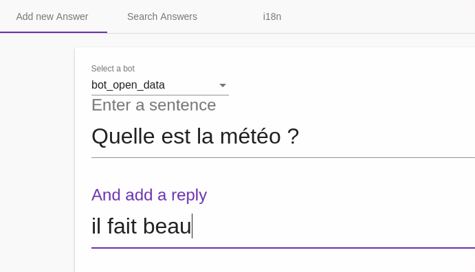
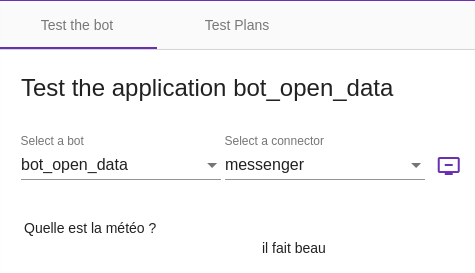

# Introduction à la boite à outils conversationnelle

## Partir d'un exemple

Un bon point de départ est le code source du [bot Open Data](https://github.com/voyages-sncf-technologies/tock-bot-open-data) 

Suivez les instructions présentes dans le README du projet pour démarrer le bot dans l'IDE (ne configurez pas Messenger ou Google Assistant à ce stade),
puis connectez vous à l'interface d'administration. Le bot est d'ors et déjà testable.

## L'onglet Test

Via cet onglet, vous pouvez commencer à tester le bot :

L'interface est minimale car il s'agit d'un mode de test. 

L'objectif reste de faire dialoguer vos utilisateurs avec le bot via des canaux comme Messenger, Google Assistant...
ou vos sites ou applications.

## L'onglet Monitoring

Il est ensuite possible de consulter la discussion que vous venez d'avoir avec le bot via l'onglet Monitoring

Ici, le canal est indiqué comme étant celui de Messenger puisque il a été simulé une conversation Messenger.

## L'onglet Build

### Ajouter une intention avec réponse spécifique

Via la catégorie **Add new Answer**, il est possible d'ajouter du comportement spécifique :
 

Puis de tester ensuite la nouvelle intention et sa réponse :

### Modification des réponses et internationalisation

Enfin il est possible de modifier chaque réponse du bot par type d'interface (chat/voix), par type de connecteur et par langue
via l'onglet **i18n**.

Il est aussi possible de rajouter des réponses alternatives ( à chaque fois une réponse de la liste sera choisie au hasard) via cette interface.

